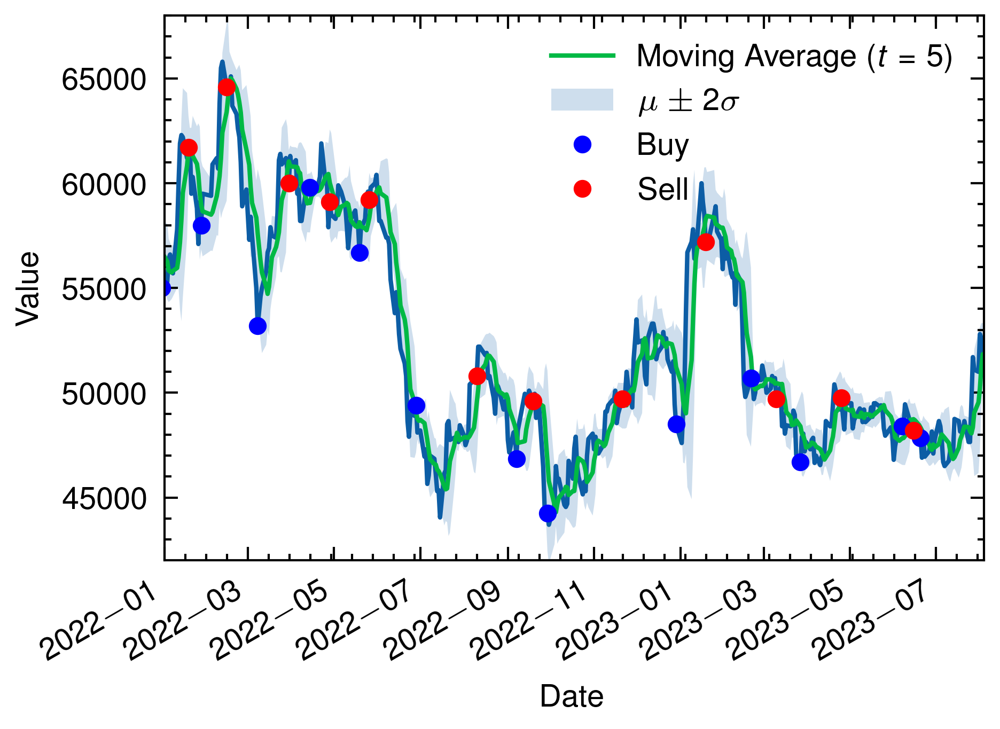
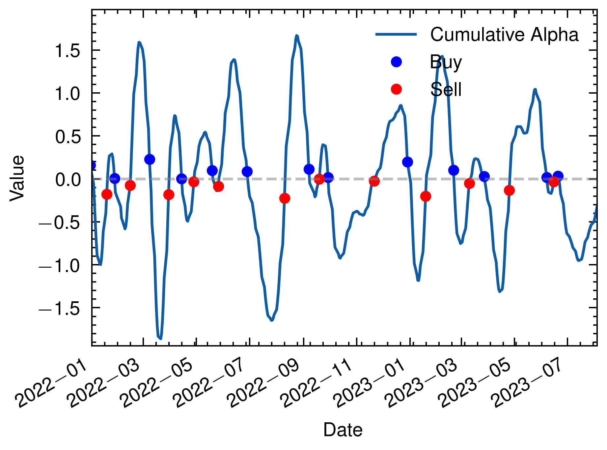
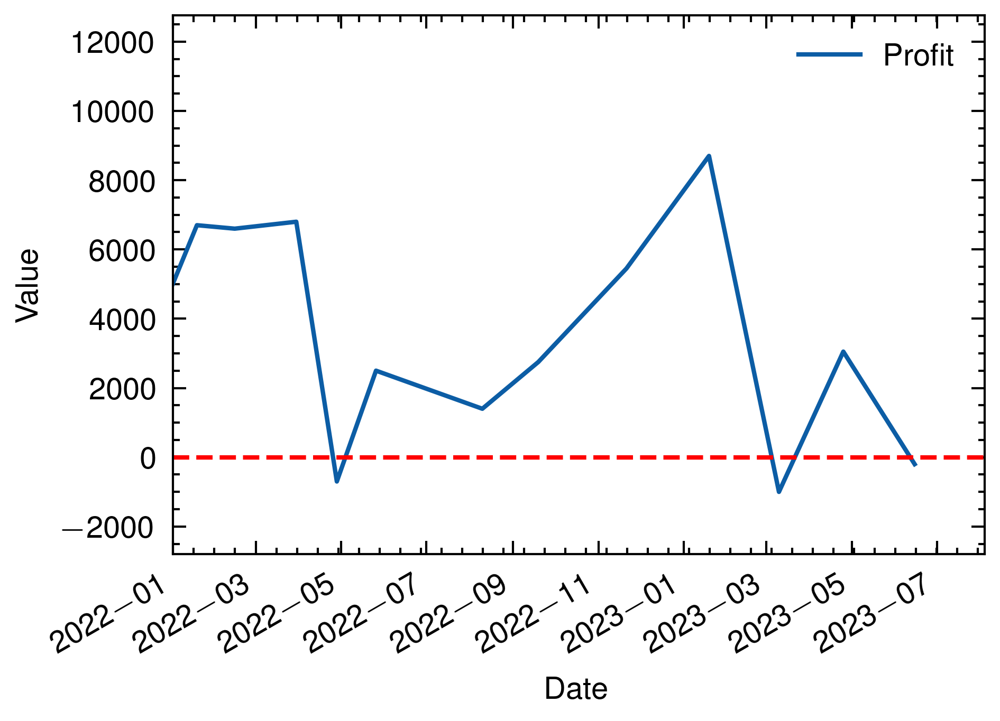

# Quantauri

This project is a comprehensive quantitative finance analysis toolkit that demonstrates data download, computation of alpha, and plotting techniques. It is divided into three main components:

1. **Data Download**: A script to download financial data for a specific stock using the FinanceDataReader library.
2. **Make an Alpha**: Rust code to compute alpha, standard deviation, mean, and other statistical properties over a given time interval.
3. **Plot**: Python code that uses Matplotlib to plot various characteristics of the data including the moving average, cumulative alpha, buy and sell signals, and profit.

## Prerequisites

Ensure that you have the following libraries and tools installed:

- Python 3.x
- Rust
- FinanceDataReader (Python)
- Pandas (Python)
- Matplotlib (Python)
- scienceplots (Python)
- peroxide (Rust)
- Parquet file handling libraries

## Structure

### 1. Data Download (`script/observe.py`)

This script downloads stock data for the given symbol ('105560') and time frame ('2000-01-01' to '2023-08-04') using the FinanceDataReader library. The data is then saved as a Parquet file.

### 2. Make an Alpha (`src/main.rs`)

The Rust code reads the downloaded data and calculates various statistical properties including the time series mean, standard deviation, deviation from mean, alpha, and cumulative alpha. It then writes the result as a Parquet file.

### 3. Plot (`pq_plot.py`)

This script reads the computed data and plots various graphs such as the stock's closing price with moving averages, cumulative alpha, buy/sell indicators, and profit per buy-sell pair.

## Usage

1. **Data Download**:
   ```
   python script/observe.py
   ```

2. **Make an Alpha**:
   ```
   cargo run
   ```

3. **Plot**:
   ```
   python pq_plot.py
   ```

The results will be saved in the `plot` directory.

## Buy and Sell Signal

The buy and sell signals are determined based on sign change in cumulative alpha:
- Buy: When cumulative alpha changes from positive to negative.
- Sell: When cumulative alpha changes from negative to positive.

## Result for KB Financial Group

### 1. Close



### 2. Cumulative Alpha (Smoothing)



### 3. Profit for each buy-sell pair



## Contributing

Feel free to open issues or pull requests if you find any bugs or have suggestions to improve the project.

## License

This project is licensed under the MIT License - see the [LICENSE.md](LICENSE.md) file for details.
