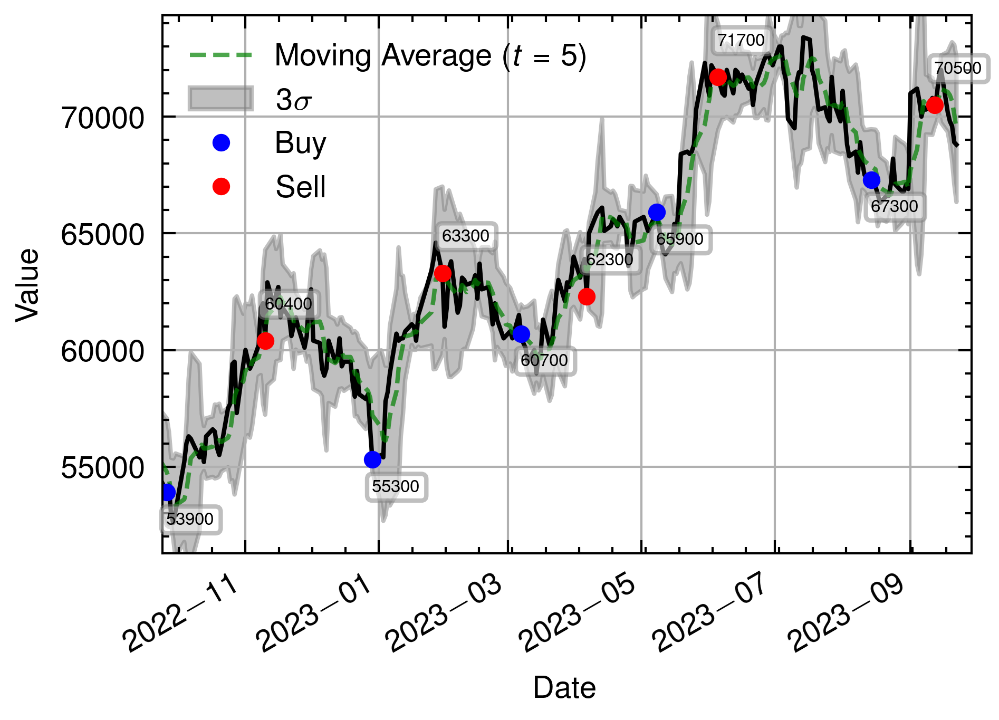
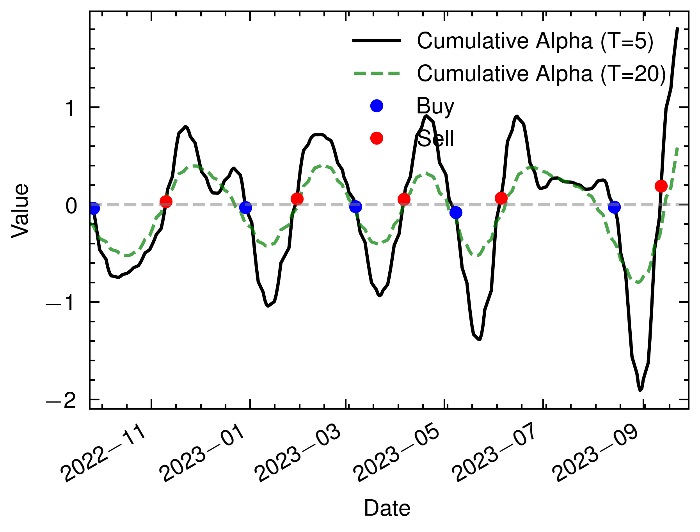
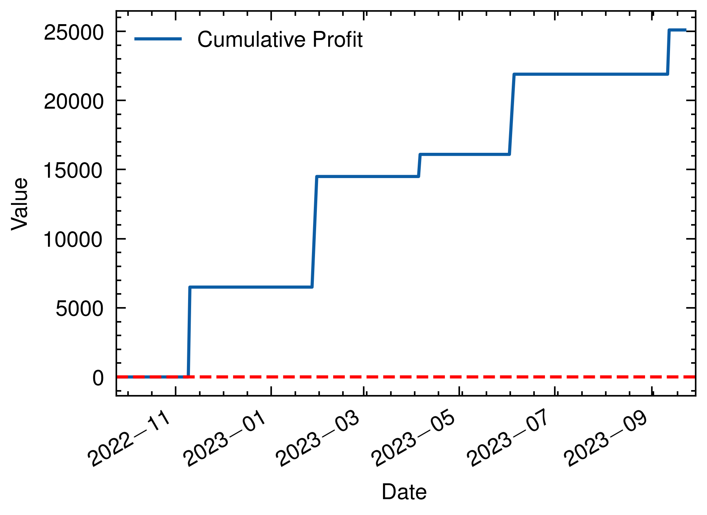

# Quantauri

This project is a comprehensive quantitative finance analysis toolkit that demonstrates data download, computation of alpha, and plotting techniques. It is divided into three main components:

1. **Data Download**: A script to download financial data for a specific stock using the FinanceDataReader library.
2. **Make an Alpha**: Rust code to compute alpha, standard deviation, mean, and other statistical properties over a given time interval.
3. **Plot**: Python code that uses Matplotlib to plot various characteristics of the data including the moving average, cumulative alpha, buy and sell signals, and profit.

## Prerequisites

Ensure that you have the following libraries and tools installed:

- Python 3.x
- Rust
- FinanceDataReader (Python)
- Pandas (Python)
- Matplotlib (Python)
- scienceplots (Python)
- peroxide (Rust)
- Parquet file handling libraries

## Structure

### 1. Data Download (`script/observe.py`)

This script downloads stock data for the given symbol ('105560') and time frame ('2000-01-01' to '2023-08-04') using the FinanceDataReader library. The data is then saved as a Parquet file.

### 2. Make an Alpha (`src/main.rs`)

The Rust code reads the downloaded data and calculates various statistical properties including the time series mean, standard deviation, deviation from mean, alpha, and cumulative alpha. It then writes the result as a Parquet file.

### 3. Plot (`pq_plot.py`)

This script reads the computed data and plots various graphs such as the stock's closing price with moving averages, cumulative alpha, buy/sell indicators, and profit per buy-sell pair.

## Usage

```sh
cargo run --release

# And input code as string
```

The results and plots will be saved in the `data` and `plot` directory.

## Buy and Sell Signal

The buy and sell signals are determined based on sign change in cumulative alpha:
- Buy: When cumulative alpha changes from positive to negative.
- Sell: When cumulative alpha changes from negative to positive.

## Result for Samsung Electronics (code: 005930)

### 1. Close



### 2. Cumulative Alpha (Smoothing)



### 3. Profit for each buy-sell pair


### 4. Cumulative profit



## Stock lists

Name | Code | Close | Cumulative alpha | Profit | Cumulative profit
:--: | :--: | :----: | :-------------: | :----: | :---------------:
KIA (기아) | 000270 | [close](./plot/000270/close.png) | [calpha](./plot/000270/calpha.png) | [profit](./plot/000270/profit.png) | [cprofit](./plot/000270/cprofit.png)
Cosmo Advanced Materials (코스모신소재) | 005070 | [close](./plot/005070/close.png) | [calpha](./plot/005070/calpha.png) | [profit](./plot/005070/profit.png) | [cprofit](./plot/005070/cprofit.png)
LG Chem (LG화학) | 051910 | [close](./plot/051910/close.png) | [calpha](./plot/051910/calpha.png) | [profit](./plot/051910/profit.png) | [cprofit](./plot/051910/cprofit.png)
Hyundai Motor (현대자동차) | 005380 | [close](./plot/005380/close.png) | [calpha](./plot/005380/calpha.png) | [profit](./plot/005380/profit.png) | [cprofit](./plot/005380/cprofit.png)
POSCO Holdings (POSCO홀딩스) | 005490 | [close](./plot/005490/close.png) | [calpha](./plot/005490/calpha.png) | [profit](./plot/005490/profit.png) | [cprofit](./plot/005490/cprofit.png)
Samsung Electronics (삼성전자) | 005930 | [close](./plot/005930/close.png) | [calpha](./plot/005930/calpha.png) | [profit](./plot/005930/profit.png) | [cprofit](./plot/005930/cprofit.png)
Hotel Shilla (호텔신라) | 008770 | [close](./plot/008770/close.png) | [calpha](./plot/008770/calpha.png) | [profit](./plot/008770/profit.png) | [cprofit](./plot/008770/cprofit.png)
Kakao (카카오) | 035720 | [close](./plot/035720/close.png) | [calpha](./plot/035720/calpha.png) | [profit](./plot/035720/profit.png) | [cprofit](./plot/035720/cprofit.png)
L&F (엘엔에프) | 066970 | [close](./plot/066970/close.png) | [calpha](./plot/066970/calpha.png) | [profit](./plot/066970/profit.png) | [cprofit](./plot/066970/cprofit.png)
Celltrion (셀트리온) | 068270 | [close](./plot/068270/close.png) | [calpha](./plot/068270/calpha.png) | [profit](./plot/068270/profit.png) | [cprofit](./plot/068270/cprofit.png)
Ecopro (에코프로) | 086520 | [close](./plot/086520/close.png) | [calpha](./plot/086520/calpha.png) | [profit](./plot/086520/profit.png) | [cprofit](./plot/086520/cprofit.png)
SK Innovation (SK이노베이션) | 096770 | [close](./plot/096770/close.png) | [calpha](./plot/096770/calpha.png) | [profit](./plot/096770/profit.png) | [cprofit](./plot/096770/cprofit.png)
CJ Cheiljedang (CJ제일제당) | 097950 | [close](./plot/097950/close.png) | [calpha](./plot/097950/calpha.png) | [profit](./plot/097950/profit.png) | [cprofit](./plot/097950/cprofit.png)
KB Financial Group (KB금융) | 105560 | [close](./plot/105560/close.png) | [calpha](./plot/105560/calpha.png) | [profit](./plot/105560/profit.png) | [cprofit](./plot/105560/cprofit.png)
ANP (나노신소재) | 121600 | [close](./plot/121600/close.png) | [calpha](./plot/121600/calpha.png) | [profit](./plot/121600/profit.png) | [cprofit](./plot/121600/cprofit.png)
E-Mart (이마트) | 139480 | [close](./plot/139480/close.png) | [calpha](./plot/139480/calpha.png) | [profit](./plot/139480/profit.png) | [cprofit](./plot/139480/cprofit.png)
Ecopro BM (에코프로비엠) | 247540 | [close](./plot/247540/close.png) | [calpha](./plot/247540/calpha.png) | [profit](./plot/247540/profit.png) | [cprofit](./plot/247540/cprofit.png)
Yunsung F&C (윤성에프엔씨) | 372170 | [close](./plot/372170/close.png) | [calpha](./plot/372170/calpha.png) | [profit](./plot/372170/profit.png) | [cprofit](./plot/372170/cprofit.png)
LG Energy Solution (LG에너지솔루션) | 373220 | [close](./plot/373220/close.png) | [calpha](./plot/373220/calpha.png) | [profit](./plot/373220/profit.png) | [cprofit](./plot/373220/cprofit.png)
AMD | AMD | [close](./plot/AMD/close.png) | [calpha](./plot/AMD/calpha.png) | [profit](./plot/AMD/profit.png) | [cprofit](./plot/AMD/cprofit.png)
Coupang | CPNG | [close](./plot/CPNG/close.png) | [calpha](./plot/CPNG/calpha.png) | [profit](./plot/CPNG/profit.png) | [cprofit](./plot/CPNG/cprofit.png)
IBM | IBM | [close](./plot/IBM/close.png) | [calpha](./plot/IBM/calpha.png) | [profit](./plot/IBM/profit.png) | [cprofit](./plot/IBM/cprofit.png)
Tesla | TSLA | [close](./plot/TSLA/close.png) | [calpha](./plot/TSLA/calpha.png) | [profit](./plot/TSLA/profit.png) | [cprofit](./plot/TSLA/cprofit.png)

## Contributing

Feel free to open issues or pull requests if you find any bugs or have suggestions to improve the project.

## License

This project is licensed under the MIT License - see the [LICENSE.md](LICENSE.md) file for details.
